# Premier League High Scorer Predictor

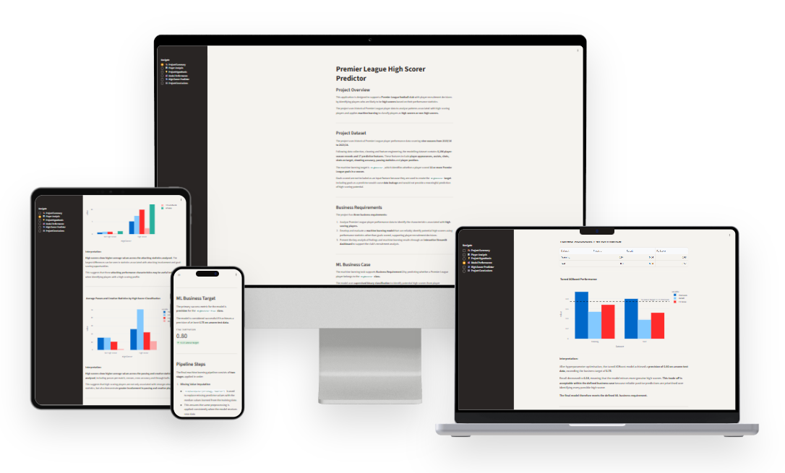

## Project Overview

This project is a data analytics and machine learning application designed to support player recruitment decisions for a Premier League football club.

The project analyses historical Premier League player performance data across nine seasons, from 2015/16 to 2023/24, to investigate the characteristics associated with high-scoring players.

A supervised machine learning model is developed to classify whether a player demonstrates the characteristics of a `HighScorer`, defined as a player who scores 10 or more goals in a season. To prevent data leakage, the model uses performance indicators other than goals scored.

The results of the data analysis and machine learning model are presented through an interactive Streamlit dashboard. The dashboard allows users to explore the key analytical findings, review the performance of the machine learning model, and enter player statistics to generate an interactive high-scorer prediction.

The application is intended to support recruitment analysis and scouting decisions rather than replace wider football knowledge and professional scouting processes.

## Dataset Content

The dataset contains historical Premier League player performance statistics covering nine seasons from **2015/16 to 2023/24**.

The original data was provided across nine CSV files, with each file representing a single Premier League season. These files were combined into a single dataset during the data collection stage, with a `Season` column added to identify the season associated with each player record.

The data contains player-level performance statistics including:

- Appearances and playing position
- Shooting and attacking statistics
- Assists and creative statistics
- Passing statistics
- Discipline and defensive statistics
- Goalkeeper specific stats

During data cleaning, duplicate records, invalid player-season records and inconsistent data formats were identified and handled. Missing values were also investigated to distinguish between structural missing values and genuinely unavailable statistics.

Following data cleaning, the dataset contains **8,196 player-season records** across the nine Premier League seasons.

For machine learning, a binary target variable named `HighScorer` was created. A player is classified as a high scorer when they scored **10 or more goals in a season**.

Feature engineering and feature selection produced **17 predictor features** for the final machine learning model.

### Data Quality and Cleaning

The data quality and cleaning process involved the following steps:

**Duplicate Records**

- Duplicate player-season records were identified and removed. **6 duplicate records** were identified and removed during data cleaning.

**Invalid Records**

- Invalid player-season records were identified based on inconsistent data structures and missing critical information. **4 invalid records** were removed (player-season records with more than 38 appearances, indicating cumulative rather than single-season statistics).

**Missing Values**

- Missing values were investigated to distinguish between structural and genuine missing values.
- **Structural missing values** occurred where certain statistics were not applicable (e.g., goalkeepers lack shooting statistics, outfield players lack goalkeeper-specific stats). **10 columns** of structural missing values were replaced with 0 to indicate that these statistics were not recorded for those player roles. These columns included goalkeeper-specific statistics (Saves, Penalties saved, Punches, High Claims, Catches, Sweeper clearances, Throw outs, Goal Kicks) and attacking-specific statistics (Hit woodwork, Big chances created).
- **Position-specific missing values** (Last man tackles, Clearances off line) were retained as `NaN` because they represent legitimate differences in player roles rather than incomplete data.
- **Incomplete source data** (Goals per match, Shots, Shots on target, Shooting accuracy %, Big chances missed, Clean sheets, Goals conceded) was retained as `NaN` and handled during model training using median imputation within the machine learning pipeline to prevent test-set leakage.

**Data Standardisation**

- Inconsistent data formats and types were standardised during cleaning to ensure consistency across all nine seasons.
- Percentage-based features were converted from text (with % symbols) to numeric values.
- The `Passes` column was cleaned by removing thousands separators (commas) and converting to numeric format.
- Player names, positions and other categorical variables were standardised to prevent duplicate entries due to formatting differences.

After all cleaning steps, the final dataset contained **8,196 player-season records** ready for analysis and machine learning.

## Business Requirements

The project is designed as a player recruitment analysis service for a Premier League football club. The aim is to use historical player performance data to support recruitment teams in identifying players who demonstrate the characteristics of high scorers.

The project has three business requirements:

1. Analyse Premier League player performance data to identify the characteristics associated with high-scoring players.

2. Develop and evaluate a machine learning model that can reliably identify potential high scorers using performance statistics other than goals scored, supporting player recruitment decisions.

3. Present the key analytical findings and machine learning results through an interactive Streamlit dashboard to support the club's recruitment analysis.

## Hypothesis and Validation

**Hypothesis:** Premier League players classified as high scorers will demonstrate stronger attacking statistics, particularly shots and shots on target, than players who are not classified as high scorers.

**Null Hypothesis (H0):** There is no meaningful difference in shooting statistics (shots and shots on target) between players classified as high scorers and players who are not classified as high scorers.

**How the hypothesis was validated:**

The hypothesis was investigated during the exploratory data analysis by comparing the average shooting statistics of high scorers against non-high scorers:

- **Shots:** 80.23 (high scorers) compared with 11.41 (non-high scorers)
- **Shots on target:** 34.35 compared with 3.81
- **Shooting accuracy:** 43.46% compared with 15.62%

As `Shots` and `Shots on target` are both strongly right-skewed, a one-sided **Mann-Whitney U test** (`alternative="greater"`) was used to test whether these descriptive differences are statistically significant, rather than relying on the averages alone:

- **Shots:** U = 915,837.5, p ≈ 1.64 × 10⁻¹³⁹
- **Shots on target:** U = 925,108.0, p ≈ 2.84 × 10⁻¹⁵²

Both p-values are far below the 0.05 significance threshold.

**Outcome:** The hypothesis was supported, and the null hypothesis was rejected on statistical grounds, not just descriptive averages. High scorers demonstrate significantly higher shots and shots on target than non-high scorers, providing strong statistical evidence that shooting involvement is a key characteristic associated with high scorers.

## Epics and User Stories

The project was developed around three main epics that reflect the business requirements and the needs of a recruitment analyst using the application.

### Epic 1 - Player Performance Analysis

The aim of this epic is to investigate the characteristics associated with high-scoring Premier League players.

**User Story 1**

As a recruitment analyst, I want to explore and compare historical player performance statistics so that I can understand the characteristics associated with high-scoring players.

### Epic 2 - High Scorer Machine Learning Model

The aim of this epic is to develop and evaluate a machine learning model capable of identifying players who demonstrate characteristics associated with high scorers.

**User Story 2**

As a recruitment analyst, I want a machine learning model that can reliably identify potential high scorers using performance statistics other than goals scored so that I can use the prediction to support recruitment decisions.

### Epic 3 - Interactive Recruitment Dashboard

The aim of this epic is to make the project's analysis and machine learning results accessible through an interactive dashboard.

**User Story 3**

As a recruitment analyst, I want to view the player analysis and model performance and enter player statistics to generate a high-scorer prediction so that I can use the project's findings through a simple interactive interface.

## The rationale to map the business requirements to the Data Visualizations and ML tasks

### Business Requirement 1 - Data Analysis and Visualisation

**Mapped user story:** User Story 1

**Mapped task:** Data analysis and visualisation.

Exploratory data analysis and visualisations were used to investigate the characteristics associated with high-scoring Premier League players. Relevant player statistics and playing positions were compared against the `HighScorer` target to identify meaningful patterns and relationships.

**Actions required to enable the task:**

- Collect and combine nine seasons of Premier League player statistics.
- Clean and standardise the data, then create the `HighScorer` target using the 10-goal threshold.
- Analyse the target distribution, playing positions, attacking statistics, passing statistics and correlations between relevant variables.
- Compare high scorers with other players and present each visualisation with a written interpretation and conclusion.

### Business Requirement 2 - Machine Learning

**Mapped user story:** User Story 2

**Mapped task:** Supervised binary classification.

A supervised binary classification task was used to predict whether a
player belongs to the `HighScorer` class. Goals scored and statistics
that directly reveal the target were excluded to prevent data leakage.

**Actions required to enable the task:**

- Engineer and select predictor features while excluding goals and other features that would cause data leakage.
- Split the data into stratified training and test sets and handle missing values within the machine learning pipeline.
- Train and compare Logistic Regression, Random Forest and XGBoost classification models.
- Optimise the selected XGBoost model with `GridSearchCV`, using precision for the `HighScorer=True` class as the scoring metric.
- Evaluate training and unseen test performance using classification reports and confusion matrices, then compare test precision with the minimum success target of 0.75.
- Save the fitted pipeline for use by the interactive predictor.

### Business Requirement 3 - Dashboard

**Mapped user story:** User Story 3

**Mapped tasks:** Data visualisation, model evaluation presentation and interactive classification.

The key analytical findings and machine learning results were presented through an interactive Streamlit dashboard, supported by clear visualisations and interpretations.

**Actions required to enable the tasks:**

- Create structured Streamlit pages for the project summary, player analysis, project hypothesis, model performance, high-scorer predictor and project conclusions page.
- Add sidebar navigation so the user can move between the six dashboard pages.
- Present analytical and model-evaluation plots with written interpretations linked to the business requirements.
- Load the saved machine learning pipeline, collect player statistics through widgets and display the predicted class and high-scorer probability.

## ML Business Case

The machine learning task supports **Business Requirement 2** by predicting whether a Premier League player belongs to the `HighScorer` class.

### Aim

Develop a binary classification model capable of reliably identifying potential high scorers from player performance statistics without using goals scored as a predictor.

The model is intended to support player recruitment decisions by highlighting players whose performance statistics demonstrate characteristics associated with high scorers.

### Learning Method

Supervised binary classification was used because the historical training data contains a known `HighScorer` target.

Multiple classification algorithms were compared before selecting and optimising the final model.

### Ideal Outcome and Success/Failure Metrics

The ideal model should make reliable positive predictions so that players identified as potential high scorers are likely to genuinely belong to the `HighScorer` class.

Precision for the `HighScorer=True` class was used as the primary success metric. A false-positive prediction could lead to a club investing time and money in a player who does not demonstrate the required high-scoring profile.

Missing a genuine high scorer is considered less costly than incorrectly recommending a player as a high scorer. Recall was therefore treated as a secondary metric.

F1-score was also considered to provide additional context on the balance between precision and recall.

The final model was considered successful if it achieved a precision of at least **0.75** for the `HighScorer` class on unseen test data.

Training and test performance were also compared to identify potential overfitting.

### Model Output

The model outputs a binary prediction indicating whether a player is classified as a potential high scorer.

### Relevance to the User

The model provides a data-driven tool to support player recruitment by identifying players whose performance statistics resemble those associated with high scorers.

The prediction is intended to support recruitment analysis rather than replace wider scouting and decision-making processes.

### Heuristics and Training Data

The model uses the processed historical Premier League player dataset prepared during the project. Predictor features include player performance statistics and playing position.

The dataset is split into training and test sets using stratification to preserve the proportion of high scorers. Missing predictor values are imputed using values learned from the training data to prevent test data from influencing model training.

## CRISP-DM Methodology

This project follows the **CRISP-DM (Cross Industry Standard Process for Data Mining)** framework, a standard approach for data science and machine learning projects.

### 1. Business Understanding

The project addresses the business need to support player recruitment decisions by identifying high-scoring player characteristics. The key business objectives are:

- Understand what distinguishes high-scoring players from others.
- Build a predictive model to support recruitment analysis.
- Present findings through an accessible interactive dashboard.

Success is measured by achieving a precision of at least 0.75 for the high-scorer classification on unseen test data.

### 2. Data Understanding

Historical Premier League player performance data covering nine seasons (2015/16 to 2023/24) was collected and explored. The data understanding phase involved:

- Combining nine seasonal CSV files into a unified dataset.
- Investigating data types, missing values and data quality.
- Distinguishing structural missing values (e.g. goalkeepers without shooting statistics) from genuinely missing data.
- Identifying that approximately 2.6% of player-season records are classified as high scorers.

### 3. Data Preparation

Data cleaning and feature engineering prepared the raw data for modelling:

- Removed duplicate and invalid player-season records.
- Standardised data formats and corrected inconsistent types.
- Engineered 17 predictor features including position encodings and derived statistics.
- Excluded goals scored and related statistics to prevent data leakage.
- Applied stratified train-test split (80% training, 20% test) to preserve class proportions.
- Implemented median imputation for missing values within the machine learning pipeline.

### 4. Modelling

Three baseline classification algorithms were trained and compared:

- **Logistic Regression:** High recall (0.95) but lower precision (0.41).
- **Random Forest:** Balanced performance with precision 0.67 and recall 0.69.
- **XGBoost:** Highest baseline precision (0.70), selected for hyperparameter optimisation.

The XGBoost model was optimised using GridSearchCV with 5-fold cross-validation, scoring on precision. Final hyperparameters:

- `learning_rate`: 0.01
- `max_depth`: 3
- `n_estimators`: 100
- `scale_pos_weight`: 1

### 5. Evaluation

The tuned XGBoost model achieved:

- **Test Precision:** 0.80 (exceeds target of 0.75)
- **Test Recall:** 0.38 (trade-off accepted within business case)
- **Test F1-score:** 0.52

Evaluation included classification reports, confusion matrices, and feature importance analysis. `Shots on target` emerged as the dominant predictor. The model meets the defined business requirement for reliable positive predictions.

### 6. Deployment

The final model was deployed through:

- Saving the fitted pipeline (imputation + XGBoost classifier) to `outputs/ml_pipeline/high_scorer_pipeline.pkl`.
- Building an interactive Streamlit dashboard with six pages for exploring findings and making predictions.
- Deploying the dashboard to Heroku for public access.

The deployed application allows users to enter player statistics and receive high-scorer predictions in real-time, supporting recruitment analysis workflows.

## Key Exploratory Data Analysis Visualisations

The following charts, produced during the exploratory data analysis, illustrate the strongest patterns identified between player statistics and the `HighScorer` target.

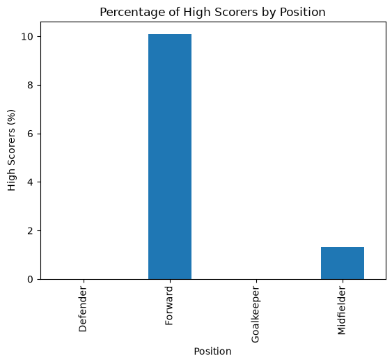

Playing position shows a clear relationship with high scorer classification, with forwards far more likely to be high scorers than midfielders, and no defenders or goalkeepers reaching the threshold.

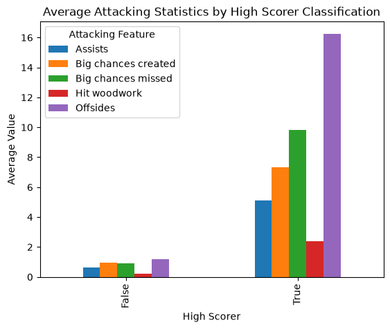

High scorers recorded substantially higher average values across key attacking statistics, including assists and big chances created, compared with non-high scorers.

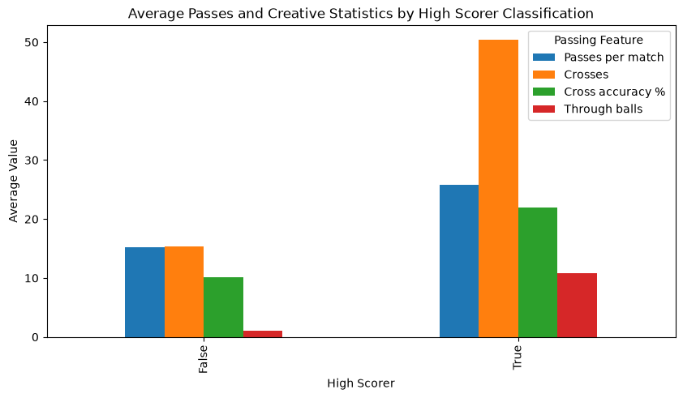

High scorers also showed greater involvement in passing and creative play, recording more passes per match, crosses and through balls than non-high scorers.

## Dashboard Design

The project results are presented through an interactive Streamlit dashboard consisting of six pages.

### Project Summary

The Project Summary page introduces the project and provides context for the analysis and machine learning tasks. It includes:

- An overview of the project and its purpose.
- A summary of the dataset used.
- The three business requirements.
- The machine learning business case and success criteria.

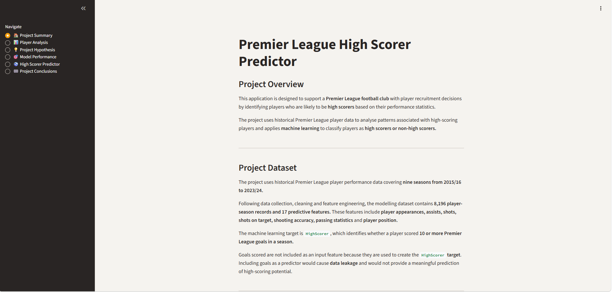

### Player Analysis

The Player Analysis page supports **Business Requirement 1** by presenting the main findings from the exploratory data analysis.

The page includes:

- Analysis of the relationship between playing position and high scorers.
- Comparison of attacking statistics between high scorers and other players.
- Comparison of passing and creative statistics between high scorers and other players.
- Written interpretations explaining the key findings from each visualisation.

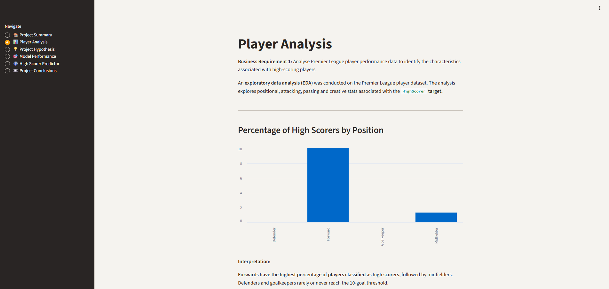

### Project Hypothesis

The Project Hypothesis page presents the project hypothesis and the evidence used to validate it during the exploratory data analysis.

The hypothesis proposes that Premier League players classified as high scorers will demonstrate stronger attacking statistics, particularly shots and shots on target, than players who are not classified as high scorers.

The page includes:

- The project hypothesis.
- A comparison of average shooting statistics between high scorers and non-high scorers.
- The key figures identified during the analysis.
- The outcome of the hypothesis validation.

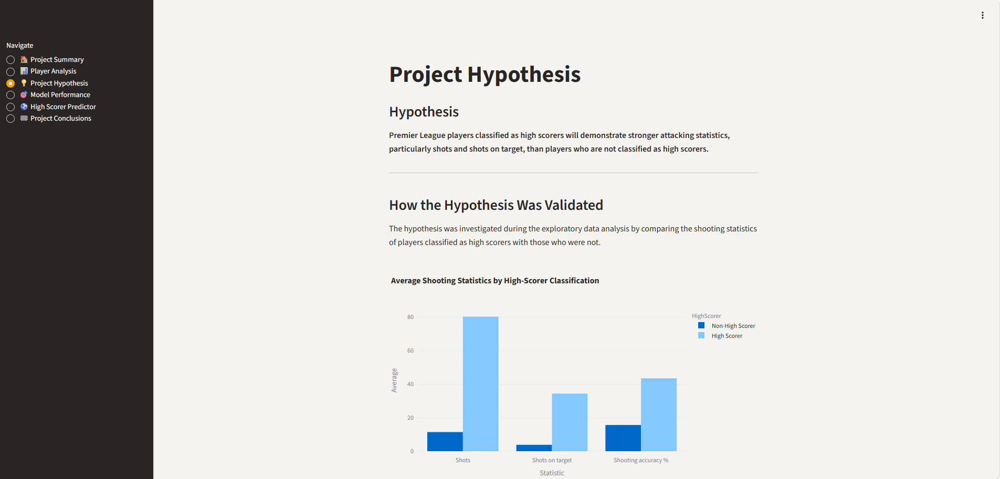

### Model Performance

The Model Performance page supports **Business Requirement 2** by presenting the development and evaluation of the machine learning model.

The page includes:

- The machine learning business target and primary success metric.
- An overview of the final machine learning pipeline.
- Comparison of the baseline classification models.
- Performance of the optimised XGBoost model on training and unseen test data.
- A confusion matrix showing the final model's classifications.
- Feature importance showing which player statistics contributed most strongly to the model.
- An interpretation of the final model's performance against the business requirement.

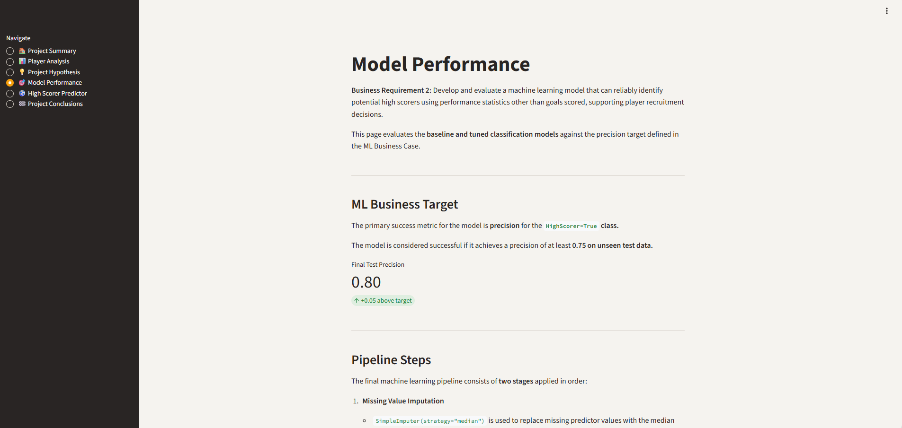

### High Scorer Predictor

The High Scorer Predictor page supports **Business Requirements 2 and 3** by allowing the user to interact with the final trained machine learning pipeline.

The user can enter player performance statistics including appearances, position, shooting, attacking, passing and creative statistics.

The submitted values are transformed into the same feature structure used during model training and passed to the saved machine learning pipeline.

The dashboard then displays:

- A classification indicating whether the player is identified as a potential high scorer.
- The model probability associated with the high-scorer class.
- A short explanation of the prediction.

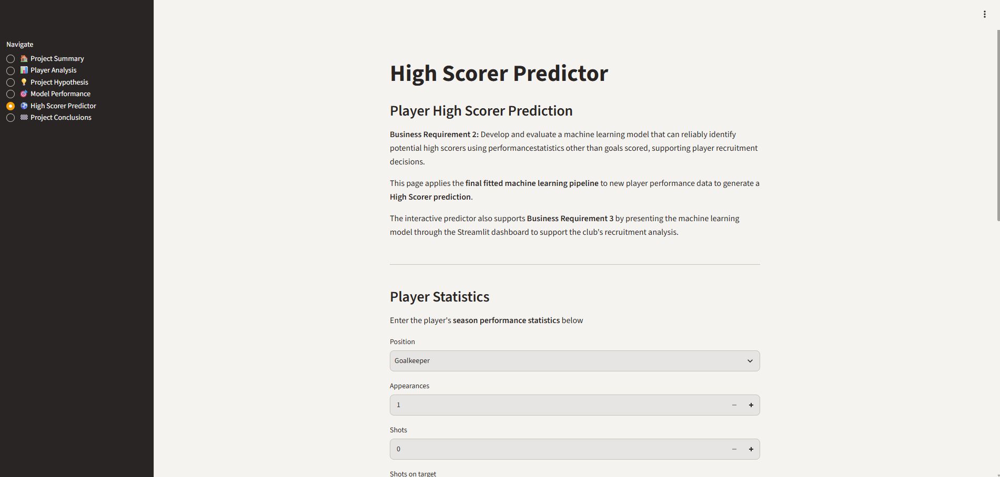
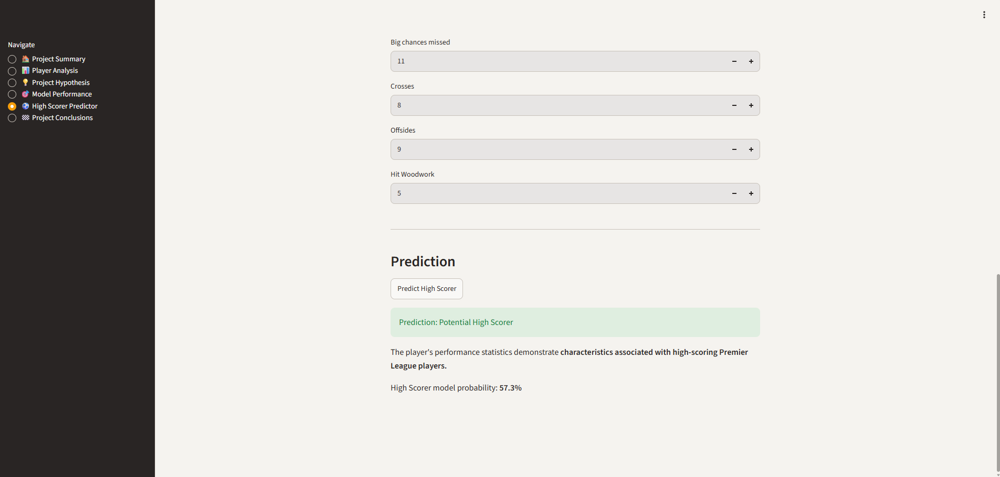

The prediction is intended to support recruitment analysis and should be considered alongside wider scouting information rather than as a standalone recruitment decision.

### Conclusions

The Conclusions page provides an overall project summary and synthesis of key findings.

The page includes:

- A recap of the project's aim to identify high-scoring player characteristics and support recruitment decisions.
- A summary of the main exploratory analysis findings, highlighting playing position, shots, and creative involvement as key differentiators.
- An overview of the final machine learning model's performance, including the achieved precision of 0.80 and how it exceeds the business requirement.
- Guidance on using the model as a supporting tool alongside professional scouting rather than as a standalone decision.
- A Future Development section outlining potential extensions such as additional seasons, recall improvement strategies, additional features, position-specific models, and ongoing model monitoring.

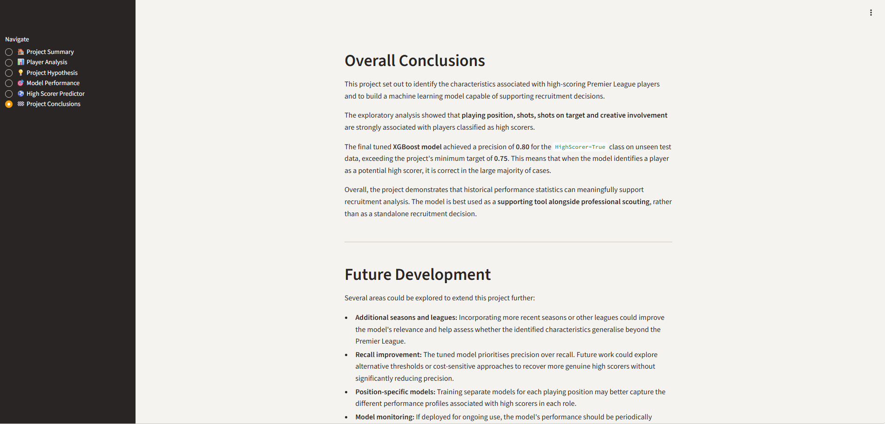

## Testing

Testing was carried out throughout the project to ensure that the data processing, machine learning pipeline, Streamlit dashboard and deployed application functioned as expected.

### Data and Machine Learning Testing

The Jupyter notebooks were run during development to verify that each stage of the data pipeline completed successfully.

The following areas were checked:

- The nine Premier League season datasets were successfully combined into a single dataset.
- Duplicate and invalid player-season records were identified and handled during data cleaning.
- Data types and missing values were inspected and handled appropriately.
- The `HighScorer` target was correctly created using the threshold of 10 or more goals in a season.
- Features that directly revealed goals scored were excluded from the predictor features to prevent data leakage.
- Training and test data were separated using a stratified split to preserve the proportion of high scorers.
- Missing predictor values were handled within the machine learning pipeline.
- Logistic Regression, Random Forest and XGBoost classifiers were evaluated on unseen test data.
- The final optimised XGBoost model achieved a precision of **0.80** for the `HighScorer=True` class on unseen test data, exceeding the project success criterion of **0.75**.
- The fitted machine learning pipeline was saved and successfully loaded by the Streamlit application.
- All five notebooks (Data Collection, Data Cleaning, Exploratory Data Analysis, Feature Engineering, Model Development) were successfully executed end-to-end. The dataset was reproduced from raw Kaggle data through to final model output, confirming full reproducibility of the analysis and model development pipeline.

### Streamlit Dashboard Testing

The Streamlit dashboard was manually tested to ensure that the application pages, visualisations and interactive predictor worked as expected.

| Feature               | Test Performed                      | Expected Result                                                      | Result |
| --------------------- | ----------------------------------- | -------------------------------------------------------------------- | ------ |
| Application           | Launch the Streamlit application    | Application loads without errors                                     | Pass   |
| Sidebar Navigation    | Select each page from the sidebar   | Selected page loads correctly                                        | Pass   |
| Project Summary       | Open the Project Summary page       | Project information and business requirements are displayed          | Pass   |
| Player Analysis       | Open the Player Analysis page       | Analysis and interactive visualisations are displayed correctly      | Pass   |
| Project Hypothesis    | Open the Project Hypothesis page    | Hypothesis, validation evidence and outcome are displayed correctly  | Pass   |
| Model Performance     | Open the Model Performance page     | Model metrics, confusion matrix and feature importance are displayed | Pass   |
| High Scorer Predictor | Open the predictor page             | Player input controls and prediction interface are displayed         | Pass   |
| Predictor Inputs      | Enter player performance statistics | Submitted values are accepted by the application                     | Pass   |
| Predictor Output      | Submit player statistics            | A High Scorer or Not High Scorer classification is returned          | Pass   |
| Model Probability     | Submit player statistics            | Model probability is displayed alongside the classification          | Pass   |
| Position Input        | Select different playing positions  | Selected position is correctly included in the model input           | Pass   |
| Heroku Deployment     | Open the deployed application       | Application loads and functions correctly on Heroku                  | Pass   |
| Conclusions Page      | Open the Conclusions page           | Project synthesis and future development guidance displayed          | Pass   |

### Deployment Testing

Following deployment to Heroku, the live application was manually checked to confirm that:

- The application loaded successfully.
- All six dashboard pages were accessible.
- Interactive Plotly visualisations displayed correctly.
- The saved machine learning pipeline loaded correctly.
- Player statistics could be submitted through the High Scorer Predictor.
- Predictions and model probabilities were returned successfully.

## Unfixed Bugs and Limitations

There are currently no known unfixed functional bugs within the application.

The following limitations should be considered:

- **Class imbalance** - Only approximately **2.6%** of player-season records are high scorers, making the classification task challenging.
- **Precision and recall** - The final model achieved **0.80 precision**, exceeding the target of **0.75**, but recall was **0.38**. This reflects the project's priority of reducing false-positive recruitment recommendations.
- **Feature importance** - `Shots on target` has a strong influence on the model. Feature importance should not be interpreted as causation or a universal threshold for identifying high scorers.
- **Historical data** - The model was trained on Premier League data from **2015/16 to 2023/24** and may become less representative as player and league patterns change.
- **Recruitment decisions** - The model identifies characteristics associated with historical high scorers and does not guarantee future goal-scoring performance. It should support, rather than replace, professional scouting.

## Deployment

### Heroku

The application is deployed on Heroku and can be accessed here:

[Premier League High Scorer Predictor](https://premier-league-highscorer-f334f7b727e7.herokuapp.com/)

To deploy the application to Heroku:

1. Create a Heroku account and create a new application with a unique application name.

2. Ensure the project contains the required deployment files, including `requirements.txt`, `Procfile`, `runtime.txt`, `.python-version` and `setup.sh`.

3. The `Procfile` contains the command used to start the Streamlit application:

   `web: streamlit run app.py --server.port=$PORT`

4. The `setup.sh` file contains Streamlit server configuration for Heroku. The current deployment passes the Heroku `$PORT` directly through the `Procfile` and uses the project-level `.streamlit/config.toml` for the active Streamlit configuration, so `setup.sh` is retained in the repository but is not executed by the current `Procfile`.

5. Streamlit server configuration and theme settings are stored in `.streamlit/config.toml`.

6. From the Heroku application dashboard, open the **Deploy** section and select **GitHub** as the deployment method.

7. Connect Heroku to GitHub, search for the project repository and select **Connect**.

8. Select the `main` branch and choose **Deploy Branch**.

9. Heroku will install the dependencies from `requirements.txt` and start the Streamlit application using the command defined in the `Procfile`.

10. Once the build has completed successfully, select **Open App** to launch the deployed Streamlit application.

## Technologies Used

### Languages

- **Python** - Used for data collection, data cleaning, exploratory data analysis, feature engineering, machine learning and the Streamlit application.
- **Markdown** - Used throughout the Jupyter notebooks and project documentation to explain the analysis, findings and development process.

### Python Packages

- **Pandas** - Used to load, combine, clean, transform and analyse the Premier League player datasets.
- **NumPy** - Used for numerical operations and data manipulation during the analysis and machine learning workflow.
- **Matplotlib** - Used to create data visualisations during exploratory data analysis and model evaluation.
- **Plotly** - Used to create interactive visualisations for the Streamlit dashboard.
- **Scikit-learn** - Used for train/test splitting, preprocessing, model pipelines, baseline classification models, model evaluation and hyperparameter optimisation.
- **XGBoost** - Used to build the final `XGBClassifier` high-scorer classification model.
- **Joblib** - Used to save and load the fitted machine learning pipeline.
- **Streamlit** - Used to build the interactive dashboard and High Scorer Predictor.

## Credits

### Learning and Development Resources

- **Code Institute** - The Predictive Analytics course material and walkthrough projects were used as guidance for the overall project structure, machine learning workflow and Streamlit dashboard development.
- **Pandas Documentation** - Used as a reference for data manipulation, cleaning and analysis.
- **Scikit-learn Documentation** - Used as a reference for machine learning pipelines, preprocessing, model training, hyperparameter optimisation and model evaluation.
- **XGBoost Documentation** - Used as a reference when developing and configuring the `XGBClassifier` model.
- **Streamlit Documentation** - Used as a reference when developing and configuring the interactive dashboard.
- **Plotly Documentation** - Used as a reference when creating interactive dashboard visualisations.
- **ChatGPT** - Used as a development support tool for troubleshooting issues, explaining programming and machine learning concepts, and helping to quickly locate relevant areas of official documentation. All project code, analysis and implementation decisions were reviewed and understood as part of the development process.

### Dataset

The Premier League player statistics used in this project were obtained from the Kaggle dataset [English Premier League EPL Player Stats(till23/24)](https://www.kaggle.com/datasets/krishanthbarkav/english-premier-leagueepl-player-statistics).
